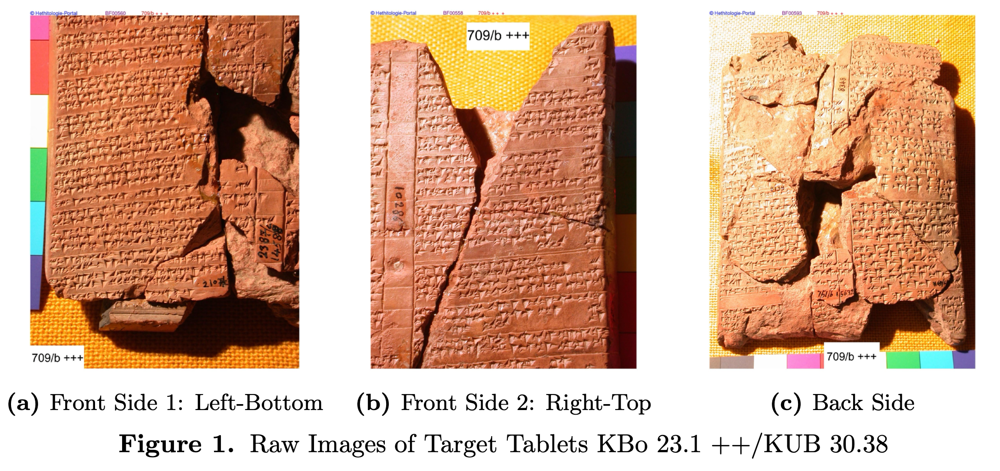
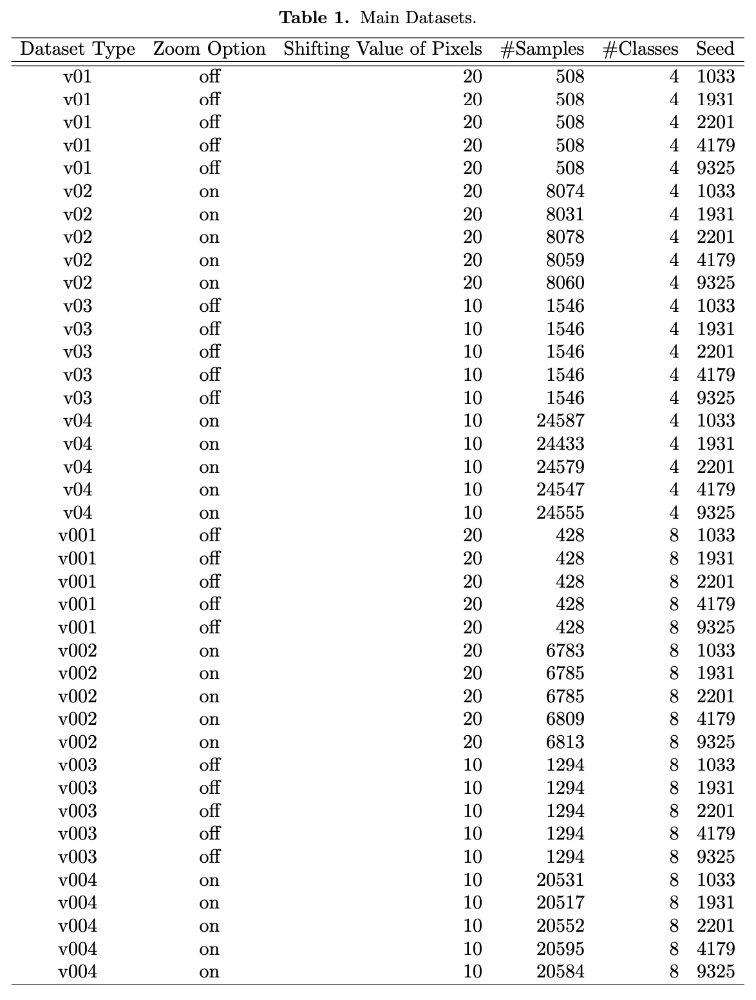

Author: Daichi Kohmoto, Katsutoshi Fukuda, Daisuke Yoshida, Takafumi Matsui, Sachihiro Omura 

Papers: [Main Paper][Supplementary Material](not yet published)

Copyright (c) 2022 Daichi Kohmoto  
Released under the MIT license  
https://github.com/barrejant/Tablet_CNN_Analysis_2022/blob/main/LICENSE

These codes are provided to reproduce results of our study, *"CNN-BASED IMAGE MODELS VERIFY A HYPOTHESIS ON TRAINING SKILLS OF WRITING CUNEIFORM TABLETS AT THE AGE OF HITTITE EMPIRE"*. Details for running codes are described in the below. All codes are provided under the MIT license. 

# Our Working Environment


- Ubuntu 18.04 LTS
- at least 1 GPU
- Anaconda
  - an virtual env: `tablet_CNN_analysis_2022.yml`

Starting by cloning this repository at an appropriate place in your machine
```
git clone https://github.com/barrejant/Tablet_CNN_Analysis_2022.git
cd Tablet_CNN_Analysis_2022
```
and by setting the above virtual environment. 

# Notes

- Each step (except for Step 0) depends on results of previous step. 
- Each step automatically generates necessary directories to store results. 
The parts of names of such directories are necessary to specify via argument parameters by yourself.
- All images used in this study have the extension `.jpg`.

# Steps

Proceed following steps one-by-one. 

## 0. Prepare images from Catalog der Texte der Hethiter of Hethitologie-Portals Mainz.

Downloading image files from [Catalog der Texte der Hethiter of Hethitologie-Portals Mainz](https://www.hethport.uni-wuerzburg.de/CTH/) via the following:
```
python download_raw_images_from_CTH.py --output_dir_name raw_images
```
As a result, our directory has the following structure:
<pre>
Tablet_CNN_Analysis_2022
└── raw_images
  ├── 01.jpg
  ├── 02.jpg
  └── 03.jpg
</pre>
Please verify downloaded image data by comparing them to the `Figure 1` of our paper. (a),(b),and (c) correspond to `01.jpg`, `02.jpg`, and `03.jpg`, respectively.  



## 1. Cropping rectangular image pieces from raw images, defining classes (4 or 8 classes).
```
python cropping_rectangular_image_pieces.py --n_classes 4 --output_dir_name rectangular_images --raw_imagedata_dir raw_images
python cropping_rectangular_image_pieces.py --n_classes 8 --output_dir_name rectangular_images --raw_imagedata_dir raw_images
```
As a result, our directory has the following structure:
<pre>
Tablet_CNN_Analysis_2022
├── raw_images
├── rectangular_images__n_classes_4
│ ├── class_01
│ ├── ...
│ └── class_04
└── rectangular_images__n_classes_8
  ├── class_01
  ├── ...
  └── class_08
</pre>

## 2. Generating 40 main datasets via data augmentation with train/test splitting.
```
bash making_main_datasets.sh
```
As a result, our directory has the following structure:
<pre>
Tablet_CNN_Analysis_2022
├── raw_images
├── rectangular_images__n_classes_4
├── rectangular_images__n_classes_
├── __TrainTestRatio__0.8__CutSize__60__seed__2201__TrashTHRatio__1.0main_datasets_****__DataSetType__v01
│ ├── train
│ │ ├── class_01
│ │ ├── ...
│ │ └── class_04
│ └── test
│   ├── class_01
│   ├── ...
│   └── class_04
├── __TrainTestRatio__0.8__CutSize__60__seed__2201__TrashTHRatio__1.0main_datasets_****__DataSetType__v001
│ ├── train
│ │ ├── class_01
│ │ ├── ...
│ │ └── class_08
│ └── test
│   ├── class_01
│   ├── ...
│   └── class_08
...
</pre>
`****`-parts will be fixed by the time you run the python script `generating_main_datasets.py` contained in the above shell script. 

A summary of statistics on generated datasets concerning the case of the seed `9325` is described in `Table 1` in our main paper. Following is the copy of it.   



## 3. Fine-tuning VGG19/ResNet50/InceptionV3 pre-trained models for all main datasets.
```
python 
```
## 4. Outputing results

### 4.1. Outputing results 1: Learning curves.
```
python generating_learning_curves.py
```
### 4.2. Outputing results 2: Confusion matrices.
```
python generating_confusion_matrices.py 
```
### 4.3. Outputing results 3: Class activation mapping for VGG19 fine-tuned models. 
```
python generating_CAM_forVGG19.py 
```

## Citing this repository via BibTeX
```
@software{Tablet_CNN_Analysis_2022,
  author = {Daichi Kohmoto, Katsutoshi Fukuda, Daisuke Yoshida, Takafumi Matsui, Sachihiro Omura},
  month = {8},
  title = {{CNN-BASED IMAGE MODELS VERIFY A HYPOTHESIS ON TRAINING SKILLS OF WRITING CUNEIFORM TABLETS AT THE AGE OF HITTITE EMPIRE}},
  url = {https://github.com/barrejant/Tablet_CNN_Analysis_2022/},
  version = {1.0.0},
  year = {2022}
}
```
